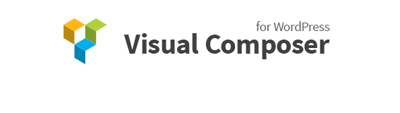

<h2>Документация по Visual Composer на русском</h2>
<ul>
	<li><a href="#preface">Предисловие</a></li>
	<ul>
		<li><a href="#introduction">Введение</a></li>
		<li><a href="#support">Техподдержка и Источники</a></li>
		<li><a href="">Условия Техподдержки</a></li>
	</ul>
</ul>
<h3><a name="preface">Предисловие</a></h3>

В данной базе знаний WPBakery вы можете найти последние версии документации для нашего плагина Visual Composer для WordPress. Мы считаем, что данная база знаний является отправной точкой для пользователей, чтобы ознакомиться с возможностями использования VC, получать ответы на наиболее часто задаваемые вопросы или разобраться в его более продвинутых функциях и опциях

Для сторонних разработчиков мы подготовили специальный раздел, посвященный VC. В нем собраны продвинутые примеры и справочная информация. Изучение этих материалов даст вам представление о том, как вы можете контролировать и расширять возможности VC собственными наборами шорткодов (Элементы Контента), разрабатывая свои дополнения для VC и много другое.
 

<h3><a name="introduction">Введение</a></h3>

 Visual Composer это очень уникальный плагин, он поможет вам в управлении контентом WP сайтов и создании потрясающих макетов всего за несколько минут без кодинга. 
В наше время многие веб-сайты имеют сложные сетки макетов, табы, слайдеры и так далее. В прошлом, чтобы создать подобный тип макетов вам нужно было быть эдаким HTML гуру или Ниндзей шорткодов. 
Но уже нет! Мы подготовили для вас короткое видео, чтобы вы могли приступить к работе в кратчайшие сроки. Посмотрите сами насколько легко создавать и управлять сложными макетами в сочетании с профессионально разработанными плагинами.

 

<h3><a name="support">Техподдержка и Источники</a></h3>

В этом разделе вы найдете список полезных источников информации, связанных с плагином Visual Composer, включая ссылки на официальную Тех. Поддержку, страницу продаж на CodeCanyon и официальный сайт. 

<h4>Источники:</h4>
<ul>
   <li><a href="https://vc.wpbakery.com/">Официальный вебсайт</a></li>
   <li><a href="https://codecanyon.net/item/visual-composer-page-builder-for-wordpress/242431?ref=wpbakery">Официальная точка продаж на CodeCanyon</a></li>
   <li><a href="http://vcpreview.com/">Официальное демо</a></li>
   <li><a href="https://vc.wpbakery.com/video-tutorials/">Обучающие видео</a></li>
   <li><a href="https://www.facebook.com/VisualComposer.wpbakery">Facebook</a></li>
   <li><a href="https://twitter.com/wpbakery">Twitter</a></li>
</ul>

<h4>Официальная Техподдержка</h4>

Чтобы получить персональную техподдержку по своему вопросу в кратчайшие сроки, пожалуйста, зайдите на нашу <a href="http://support.wpbakery.com/">страницу техподдержки</a> и откройте тикет (форма обращения в техподдержку). Чтобы его открыть, вам необходимо иметь учетную запись в нашей системе. Система регистрации полностью автоматизированная и займет у вас всего несколько минут. Пожалуйста, подготовьте свой Код Покупки (ПОЗЖЕ ВСТАВИТЬ ССЫЛКУ НА ОТВЕТ ПО ДАННОМУ ВОПРОСУ) и заполните форму "Create account in Ticket system", расположенную на <a href="http://support.wpbakery.com/">странице техподдержки</a>, а затем просто следуйте инструкциям на экране.

Прежде чем подавать заявку в техподдержку, пожалуйста, убедитесь, что вы понимаете правила техподдержки и уже прошли все шаги, описанные и перечисленные в разделе <a href="#policy">'Условия Техподдержки'</a>, чтобы мы могли решить ваш вопрос как можно быстрее.
 

<<h3><a name="policy">Условия Техподдержки</a></h3>
<
Поздравляем! Вы сделали правильный выбор, присоединившись к Справочному Центру WPBakery

